# SERVIDOR LDAP SEGURO: ldapserver19:tls

#### ASIX M11-ASO @isx46410800 Curs 2019-2020

## <u>Creamos una entidad CA propia</u>

### Genereramos la llave privada en formato PEM
`[isx46410800@miguel ldapserver19:tls]$ openssl genrsa -out ca-key.pem 1024`

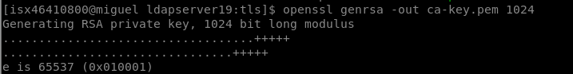

### Generamos el certificado x509 propio de la entidad CA por 365 dias en formato PEM
`[isx46410800@miguel ldapserver19:tls]$ openssl req -new -x509 -nodes -sha1 -days 365 -key ca-key.pem -out ca-crt.pem`

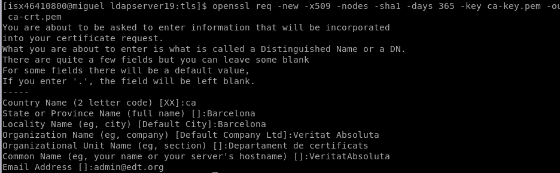

### Vemos los ficheros generados
```
[isx46410800@miguel ldapserver19:tls]$ ll ca*
-rw-rw-r--. 1 isx46410800 isx46410800 1164 Apr 11 23:14 ca-crt.pem
-rw-------. 1 isx46410800 isx46410800  887 Apr 11 23:06 ca-key.pem
```

## <u>Creamos el certificado del servidor</u>

### Genereramos la llave privada en formato PEM
`[isx46410800@miguel ldapserver19:tls]$ openssl genrsa -out server-key.pem 1024`

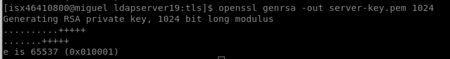

### Generamos una petición de certificado request para enviar a la entidad certificadora CA
`[isx46410800@miguel ldapserver19:tls]$ openssl req -new -key server-key.pem -out server-csr.pem`

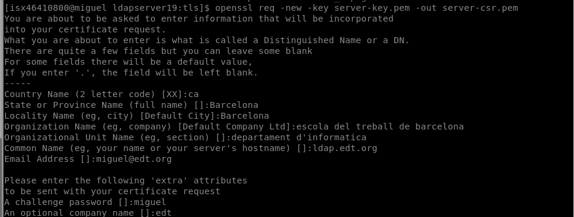

### Podemos observar la petición del certificado
`[isx46410800@miguel ldapserver19:tls]$ openssl req -noout -text -in server-csr.pem`

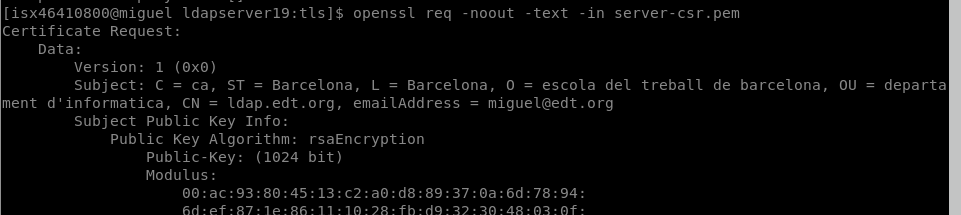

### Una entidad CA ha de firmar la petición request de certificado y devolver un certificado.crt.
+ Como en este caso somos nosotros mismos los que generamos el certificado (como Veritat Absoluta) del cliente (www.edt.org) que ha hecho el request. Creamos el fichero `ca.conf`
```
[root@miguel ldapserver]# cat ca.conf 
basicConstraints = critical,CA:FALSE
extendedKeyUsage = serverAuth,emailProtection
```

### La autoridad CA ha de firmar el certificado
`[isx46410800@miguel ldapserver19:tls]$ openssl x509 -CA ca-crt.pem -CAkey ca-key.pem -req -in server-csr.pem -days 365 -sha1 -extfile ca.conf -CAcreateserial -out server-crt.pem`

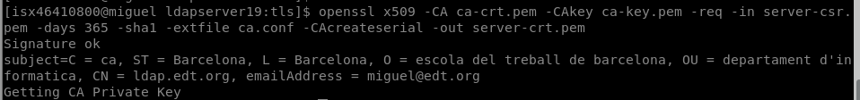

### Mostramos el número de serie que genera la CA para cada certificado que emite
```
[isx46410800@miguel ldapserver19:tls]$ cat ca-crt.srl 
9F52018E03B3B7C2
```

### La entidad le enviará al client el certificado generado: `server.crt.pem`
```
[isx46410800@miguel ldapserver19:tls]$ ll server-crt.pem 
-rw-rw-r--. 1 isx46410800 isx46410800 1131 Apr 11 23:24 server-crt.pem
```

### El cliente que ha solicitado el certificado puede validar el certificado respecto a su llave privada
```
[isx46410800@miguel ldapserver19:tls]$ openssl x509 -noout -modulus -in server-crt.pem | openssl md5
(stdin)= eb14e0fe95a3f19d9d123ed90eb15508
[isx46410800@miguel ldapserver19:tls]$ openssl rsa -noout -modulus -in server-key.pem | openssl md5
(stdin)= eb14e0fe95a3f19d9d123ed90eb15508
```

### También puede examinar el contenido del certificado para ver si es el suyo realmente
`[isx46410800@miguel ldapserver19:tls]$ openssl x509 -noout -text -in server-crt.pem`

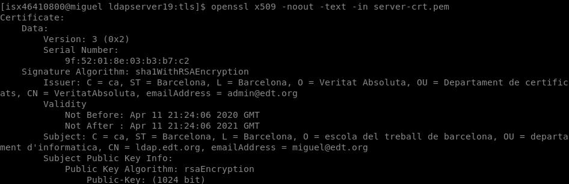


## <u>Ficheros generados</u>
```
[isx46410800@miguel ldapserver19:tls]$ ll *.pem *.srl 
-rw-rw-r--. 1 isx46410800 isx46410800 1164 Apr 11 23:14 ca-crt.pem
-rw-rw-r--. 1 isx46410800 isx46410800   17 Apr 11 23:24 ca-crt.srl
-rw-------. 1 isx46410800 isx46410800  887 Apr 11 23:06 ca-key.pem
-rw-rw-r--. 1 isx46410800 isx46410800 1131 Apr 11 23:24 server-crt.pem
-rw-rw-r--. 1 isx46410800 isx46410800  822 Apr 11 23:19 server-csr.pem
-rw-------. 1 isx46410800 isx46410800  887 Apr 11 23:07 server-key.pem
```

## <u>Dockerfile</u>
+ Hemos añadido el paquete `openssl` para las conexiones seguras y certificados

## <u>Install.sh</u>
+ Hemos copiado los certificados y las keys tal y como indicaba la explicación del PDF
```
cp /opt/docker/ca.conf /etc/openldap/certs/.
cp /opt/docker/ca-crt.pem /etc/openldap/certs/.
cp /opt/docker/ca-key.pem /etc/openldap/certs/.
cp /opt/docker/ca-crt.srl /etc/openldap/certs/.
cp /opt/docker/server-crt.pem /etc/openldap/certs/.
cp /opt/docker/server-csr.pem /etc/openldap/certs/.
cp /opt/docker/server-key.pem /etc/openldap/certs/.
```

## <u>slapd.conf<u>
+ Hemos configurado este archivo del server para aceptar conexiones seguras

```
# Allow LDAPv2 client connections.  This is NOT the default.
allow bind_v2

pidfile         /var/run/openldap/slapd.pid
TLSCACertificateFile    /etc/openldap/certs/ca-crt.pem
TLSCertificateFile      /etc/openldap/certs/server-crt.pem
TLSCertificateKeyFile   /etc/openldap/certs/server-key.pem
TLSVerifyClient         never
TLSCipherSuite HIGH:MEDIUM:LOW:+SSLv2
#argsfile       /var/run/openldap/slapd.args
```

## <u>ldap.conf (el cliente docker y en cliente de fuera local)</u>
+ Hemos configurado este archivo cliente para realizar consultas ldap seguras
```
#TLS_CACERTDIR  /etc/openldap/certs
TLS_CACERT /etc/openldap/certs/ca-crt.pem

# Turning this off breaks GSSAPI used with krb5 when rdns = false
SASL_NOCANON    on

URI ldaps://ldap.edt.org
BASE dc=edt,dc=org
```
> Nota: en el cliente de fuera del docker ponemos tambien: `TLS_REQCERT allow`

## <u>startup.sh</u>
+ Configuramos para poder encender el servicio y nos funcione para ldap y ldaps con la opcion __-h__
```
#! /bin/bash
bash /opt/docker/install.sh
ulimit -n 1024
/sbin/slapd -d0 -h "ldap:/// ldaps:///" 
```

## <u>DOCKER<u>
+ Construimos imagen:
`[isx46410800@miguel ldapserver19:tls]$ docker build -t isx46410800/ldapserver19:tls .`

+ Construimos container:
`[isx46410800@miguel ldapserver19:tls]$ docker run --rm --name ldap.edt.org -h ldap.edt.org -p 389:389  -p 636:636 -d isx46410800/ldapserver19:tls`

    + 369: puerto ldap (ldap:///)
    + 636: puerto tls (ldaps:///)

+ Comprobamos funcionamiento:
```
[isx46410800@miguel ldapserver19:tls]$ docker ps
CONTAINER ID        IMAGE                          COMMAND                  CREATED             STATUS              PORTS                                        NAMES
30e910f12456        isx46410800/ldapserver19:tls   "/bin/sh -c /opt/doc…"   4 seconds ago       Up 2 seconds        0.0.0.0:389->389/tcp, 0.0.0.0:636->636/tcp   ldap.edt.org
```
## <u>Fichero /etc/hosts en los clientes</u>
+ Añadimos: `172.17.0.2 ldap.edt.org`

## <u>COMPROBAMOS CONEXIONES</u>
+ Consulta TSL/SSL:
`[isx46410800@miguel ldapserver19:tls]$ ldapsearch -x -LLL -ZZ -b 'dc=edt,dc=org' -h ldap.edt.org dn`

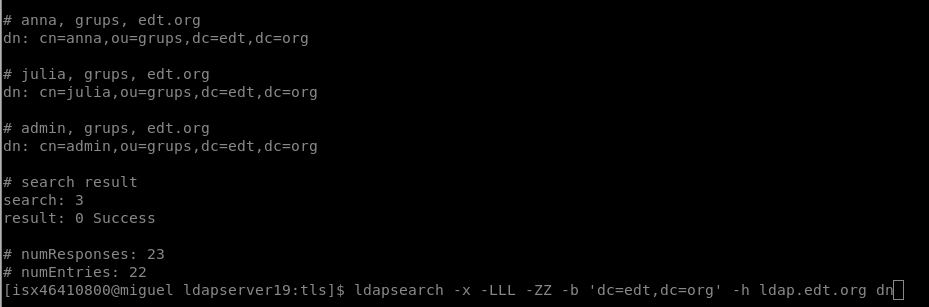

+ Consulta: `[isx46410800@miguel ldapserver19:tls]$ ldapsearch -x -LLL -ZZ`

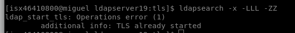

+ Consulta LDAP no seguro: `[isx46410800@miguel ldapserver19:tls]$ ldapsearch -x -LLL -H ldap://172.17.0.2 dn`

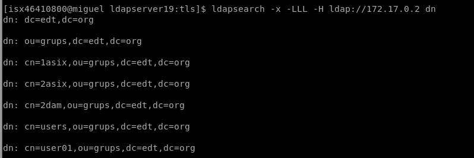

+ Consulta LDAP seguro: `[isx46410800@miguel ldapserver19:tls]$ ldapsearch -x -LLL -H ldaps://172.17.0.2 dn`

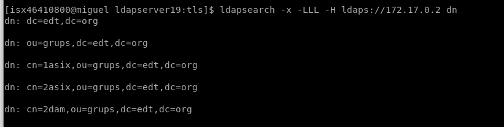

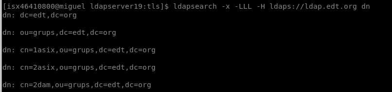

+ Consulta usando StartTLS: 
`[isx46410800@miguel ldapserver19:tls]$ ldapsearch -LLL -x -Z -H ldap://172.17.0.2 -b 'dc=edt,dc=org' dn | head`

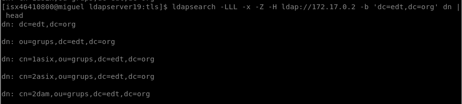

`[isx46410800@miguel ldapserver19:tls]$ ldapsearch -LLL -x -Z -H ldap://172.17.0.2 -b 'dc=edt,dc=org' 'cn=pere*'`

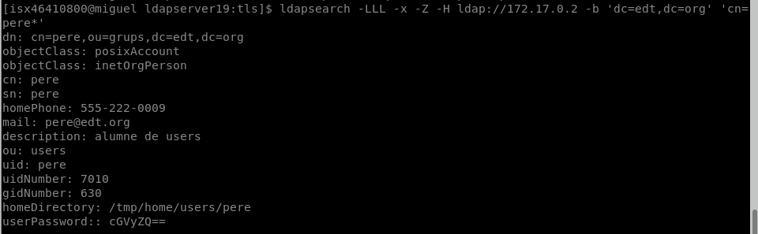

