# **Índice**
1. [EJEMPLOS 3 Y 4 DE OPENVPN CON CERTIFICADOS PROPIOS](#id1)
  1.1 [Exemple 3: Túnel Host to Host](#id11)
  1.2 [Exemple 4: Túnel Network to Network](#id12)
2. [OPENVPN EN AWS](#id2)

<a name="id1"></a>
# EJEMPLOS 3 Y 4 DE OPENVPN CON CERTIFICADOS PROPIOS

## Partimos con que ya tenemos generados los certificados y key de la CA `Veritat Absoluta`
```
[isx46410800@miguel openvpn:aws]$ ll
-rw-rw-r--. 1 isx46410800 isx46410800      83 Apr 11 23:24 ca.conf
-rw-rw-r--. 1 isx46410800 isx46410800    1164 Apr 11 23:14 ca-crt.pem
-rw-rw-r--. 1 isx46410800 isx46410800      17 Apr 11 23:24 ca-crt.srl
-rw-------. 1 isx46410800 isx46410800     887 Apr 11 23:06 ca-key.pem
```
## Ficheros de extensiones y openssl.cnf
+ A la hora de crear manualmente las keys y los certificados se han de tener en cuenta las extensiones pertinentes tanto para el servidor como para el cliente.

+ `ext.server.conf`
```
basicConstraints       = CA:FALSE
nsCertType             = server
nsComment              = "OpenSSL Generated Server Certificate"
subjectKeyIdentifier   = hash
authorityKeyIdentifier = keyid,issuer:always
extendedKeyUsage       = serverAuth
keyUsage = digitalSignature, keyEncipherment
```

+ `ext.client.conf`
```
basicConstraints        = CA:FALSE
subjectKeyIdentifier    = hash
authorityKeyIdentifier = keyid,issuer:always
```

## Creamos la clave privada y certificado del servidor
`[isx46410800@miguel openvpn:aws]$ openssl genrsa -out serverkey-vpn.pem`

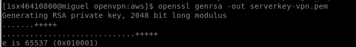

`[isx46410800@miguel openvpn:aws]$ openssl req -new -key serverkey-vpn.pem -out serverreq-vpn.pem`

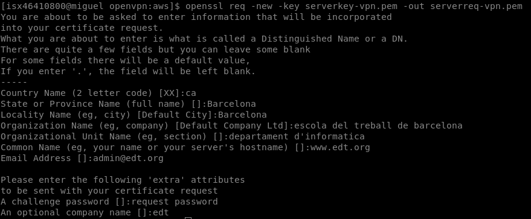

`[isx46410800@miguel openvpn:aws]$ openssl x509 -CAkey ca-key.pem -CA ca-crt.pem -req -in serverreq-vpn.pem -days 3650 -CAcreateserial -extfile ext.server.conf -out servercrt-vpn.pem`

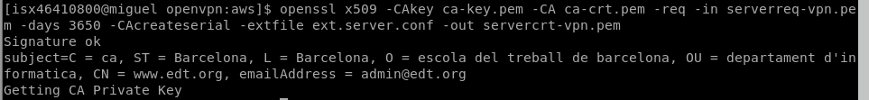

## Creamos la clave privada y el certificado de un primer cliente
`[isx46410800@miguel openvpn:aws]$ openssl genrsa -out client1key-vpn.pem`

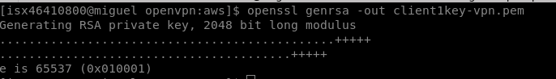

`[isx46410800@miguel openvpn:aws]$ openssl req -new -key client1key-vpn.pem -out client1req-vpn.pem`

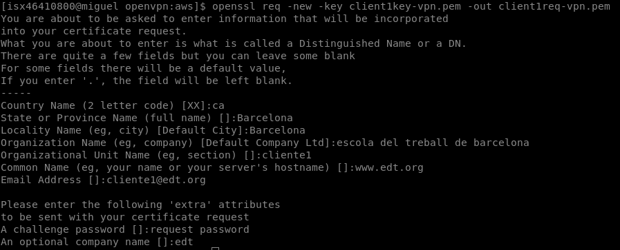

`[isx46410800@miguel openvpn:aws]$ openssl x509 -CAkey ca-key.pem -CA ca-crt.pem -req -in client1req-vpn.pem -days 3650 -CAcreateserial -extfile ext.client.conf -out client1crt-vpn.pem`

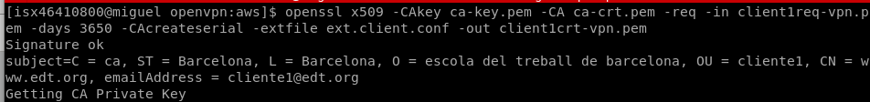

## Creamos la clave privada y el certificado de un segundo cliente
`[isx46410800@miguel openvpn:aws]$ openssl genrsa -out client2key-vpn.pem`

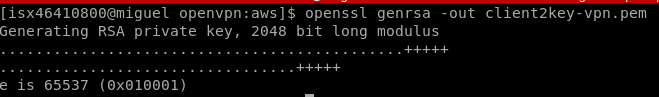

`[isx46410800@miguel openvpn:aws]$ openssl req -new -key client2key-vpn.pem -out client2req-vpn.pem`

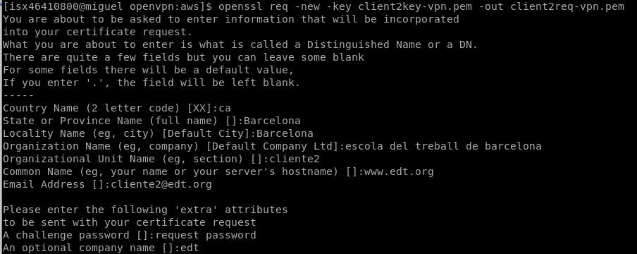

`[isx46410800@miguel openvpn:aws]$ openssl x509 -CAkey ca-key.pem -CA ca-crt.pem -req -in client2req-vpn.pem -days 3650 -CAcreateserial -extfile ext.client.conf -out client2crt-vpn.pem`

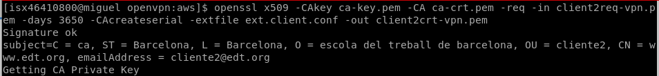

<a name="id12"></a>
## Exemple 3: Túnel Host to Host
+ En este ejemplo utilizo dos hosts de mi casa, un pc y un portatil. El PC es el servidor y el portátil es el cliente1.

+ Escribimos en el PC la orden openvpn con certificados como `servidor`:
`[isx46410800@miguel openvpn:aws]$ sudo openvpn --remote 192.168.1.43 --dev tun1 --ifconfig 10.4.0.1 10.4.0.2 --tls-server --dh dh2048.pem --ca ca-crt.pem --cert servercrt-vpn.pem --key serverkey-vpn.pem --reneg-sec 60`

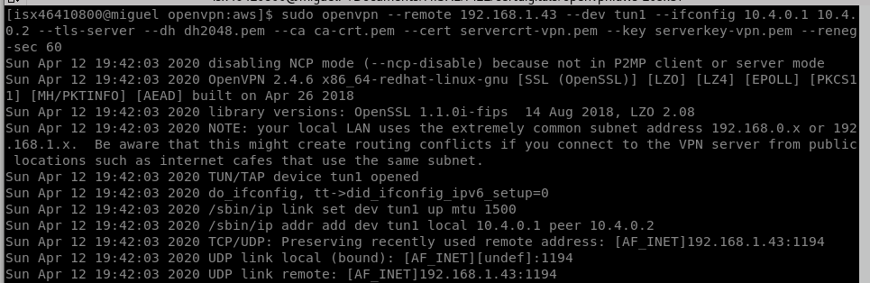

+ Vemos la interfaz `tun1` creada por el tunel VPN:

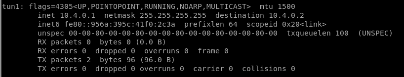

+ Escribimos en el portatil la orden openvpn con certificados como `cliente1`:
`[root@miguel-fedora keys]# openvpn --remote 192.168.1.41 --dev tun1 --ifconfig 10.4.0.2 10.4.0.1 --tls-client --ca ca-crt.pem --cert client1crt-vpn.pem --key client1key-vpn.pem --reneg-sec 60`

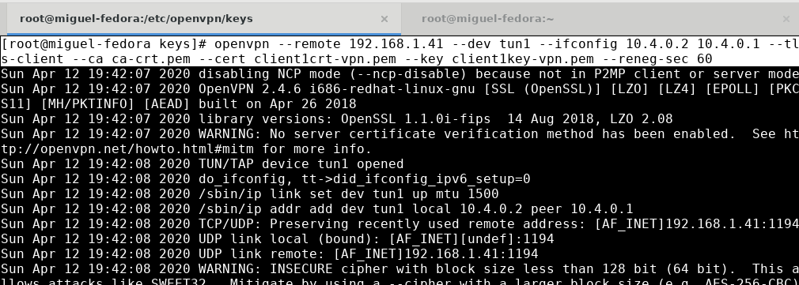

+ Vemos la interfaz `tun1` creada por el tunel VPN:

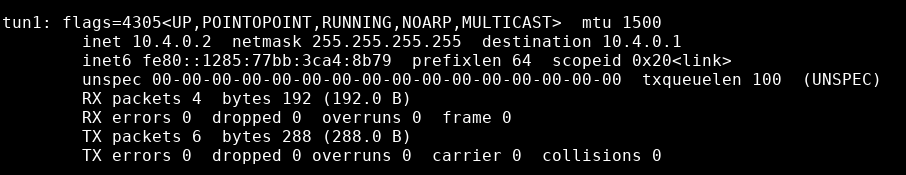

+ `Comprobaciones`:

+ En el server lo ponemos escuchar por el puerto 60000 y desde el cliente1 hacemos un telnet para comprobar que haya conexión por este tunel de openvpn:

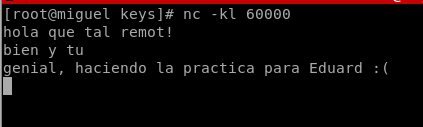

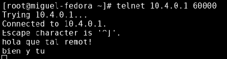

<a name="id12"></a>
## Exemple 4: Túnel Network to Network

+ En este caso tenemos dos ordenadores en casa, un pc como cliente con tres containers en una red `mynet` y un ordenador portátil que en este caso será como el server. Ambos hosts tienen sus certificados propios.
```
[isx46410800@miguel openvpn:aws]$ docker run --rm --name net1 -h net1 --net mynet -d isx46410800/net19:nethost
[isx46410800@miguel openvpn:aws]$ docker run --rm --name net2 -h net2 --net mynet -d isx46410800/net19:nethost
[isx46410800@miguel openvpn:aws]$ docker run --rm --name net3 -h net3 --net mynet -d isx46410800/net19:nethost
[isx46410800@miguel openvpn:aws]$ docker ps
CONTAINER ID        IMAGE                       COMMAND                  CREATED             STATUS              PORTS               NAMES
d324ba5c348d        isx46410800/net19:nethost   "/opt/docker/startup…"   8 seconds ago       Up 6 seconds                            net3
a3c59a21a488        isx46410800/net19:nethost   "/opt/docker/startup…"   27 seconds ago      Up 24 seconds                           net2
ac134e1b23df        isx46410800/net19:nethost   "/opt/docker/startup…"   39 seconds ago      Up 36 seconds                           net1
```
+ IPs:
```
PC: 192.168.1.41
NET1: 172.21.0.2/16
NET2: 172.21.0.3/16
NET3: 172.21.0.4/16
PORTATIL: 192.168.1.43
```
+ En cada host ejecutamos los siguientes comandos para poder establecer las conexiones:
`echo 1 > /proc/sys/net/ipv4/ip_forward`
`iptables -A FORWARD -i tun+ -j ACCEPT`

+ Añadimos la rutas de las redes con su máscara y gateway para poder enrutar el tráfico de una red a otra red con subredes:

`CLIENTE1`  
    - Orden:
```
[isx46410800@miguel openvpn:aws]$ sudo openvpn --remote 192.168.1.43 --dev tun1 --ifconfig 10.4.0.1 10.4.0.2 --tls-client --ca ca-crt.pem --cert client1crt-vpn.pem --key client1key-vpn.pem --reneg-sec 60
```

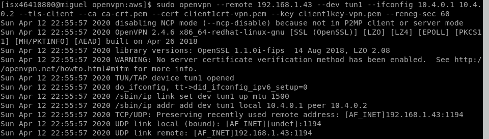  

    - Enrutamiento:

```
[root@miguel openvpn]# route add -net 10.0.1.0 netmask 255.255.255.0 gw 10.4.0.2
```


`SERVER`  

    - Orden:
```
[root@miguel-fedora keys]# openvpn --remote 192.168.1.41 --dev tun1 --ifconfig 10.4.0.2 10.4.0.1 --tls-server --dh dh2048.pem --ca ca-crt.pem --cert servercrt-vpn.pem --key serverkey-vpn.pem --reneg-sec 60
```

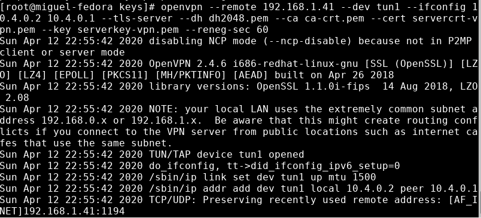  

    - Enrutamiento:

```
[root@miguel-fedora ~]# route add -net 10.0.0.0 netmask 255.255.255.0 gw 10.4.0.1
```


+ `COMPROBACIONES`:

    - Por un lado lo ponemos escuchar por el puerto 60000 y por el otro con un telnet para comprobar que haya conexión por este tunel de openvpn:

  

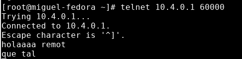  

    - Hacemos PING para comprobar también conexión:

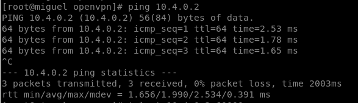

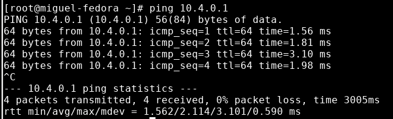

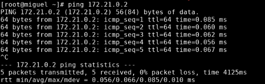

<a name="id2"></a>
## OPENVPN EN AWS
